# Знайомство з Android. Встановлення ПЗ і створення проєкту

## Встановлення програмного забезпечення

Для розробки додатків необхідно встановити такі компоненти:

- Java Development Kit (можете встановити актуальну версію);
- спеціалізоване середовище розробки Android Studio (https://developer.android.com/studio/);
- Android SDK - набір програм, утиліт і бібліотек для складання готового додатка для Android.

Процес встановлення JDK стандартний і не потребує додаткових коментарів. Android SDK буде встановлено разом зі встановленням Android Studio.

Встановлення Android Studio також досить просте. Під час вибору компонент бажано зняти виділення з пункту Android Virtual Device - ми його додамо самостійно пізніше.

  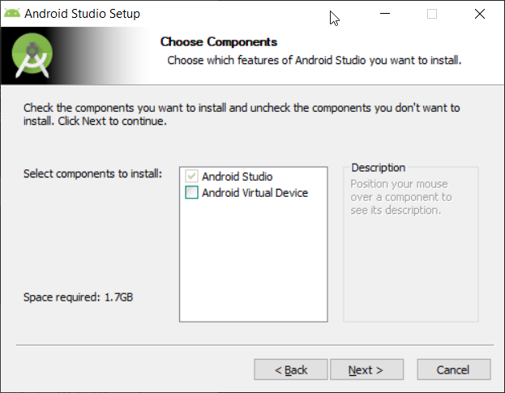

Далі установник повідомить, що на комп'ютері відсутній Android SDK і запропонує встановити компоненти SDK.

  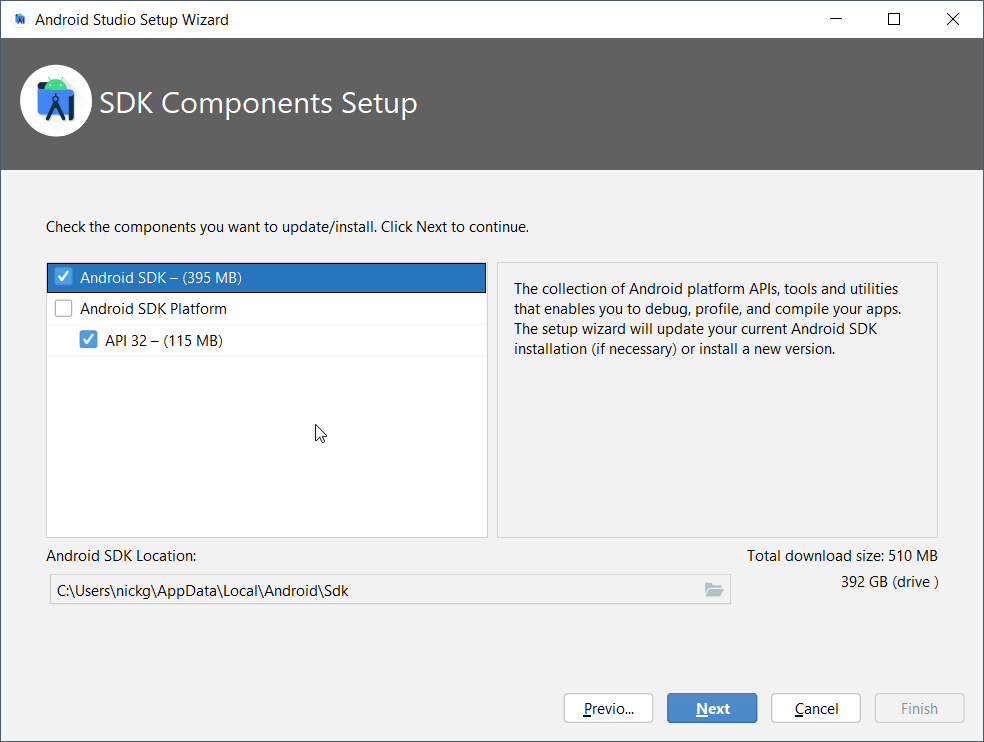

Далі необхідно погодитися з ліцензійними угодами (вибрати пункт Accept праворуч унизу).

  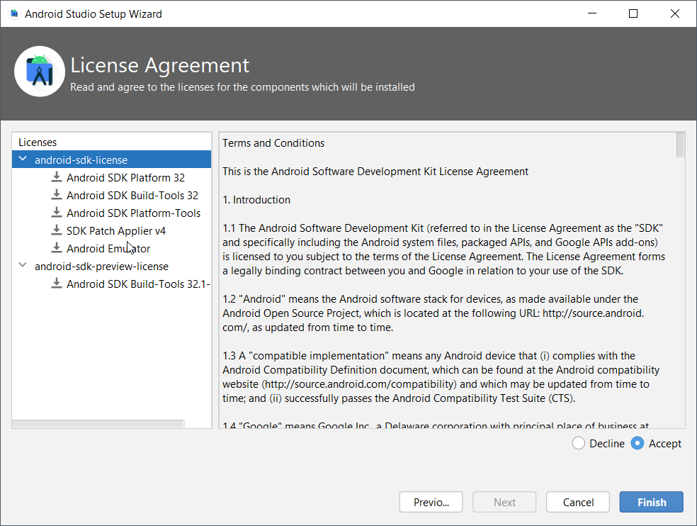

Далі інсталятор завантажить необхідні файли і тепер ми можемо запустити Android Studio.

  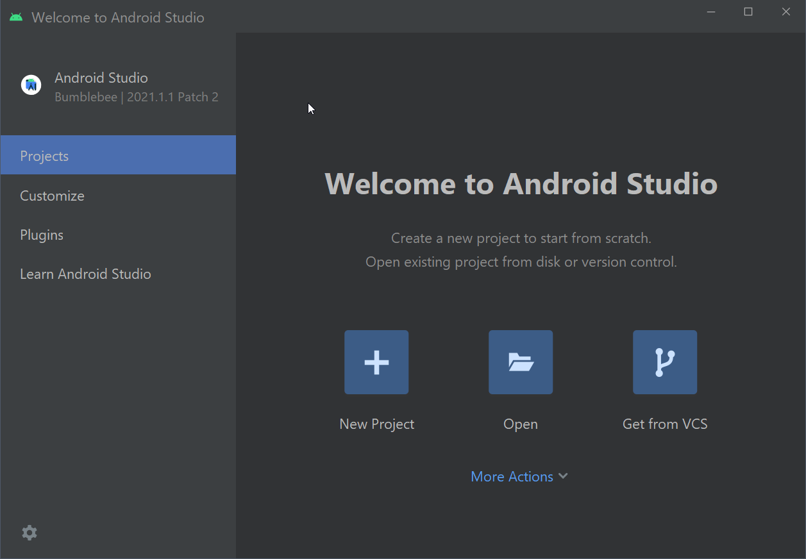

### Вимоги до процесора та операційної системи

Комфортна розробка мобільних додатків для Android неможлива без використання емулятора Android пристроїв. Ви можете використовувати сторонні емулятори.

Оскільки робота емулятора заснована на технології віртуалізації, що накладає обмеження на використовувану конфігурацію "процесор + операційна система". Для прискорення емулятора Android використовуються такі технології віртуалізації:

- Microsoft Hyper-V і платформа гіпервізора. Hyper-V - це функція віртуалізації у Windows, яка дає змогу запускати віртуалізовані комп'ютерні системи на фізичному головному комп'ютері;
- Intel Hardware Accelerated Execution Manager (HAXM). HAXM - це механізм віртуалізації для комп'ютерів на базі процесорів Intel.

Для досягнення оптимальної продуктивності рекомендується використовувати Hyper-V для прискорення емулятора Android. Якщо Hyper-V недоступний на вашому комп'ютері, можна використовувати HAXM. Емулятор Android автоматично використовує апаратне прискорення, якщо дотримано таких умов:

- апаратне прискорення доступне і ввімкнене на комп'ютері розробника; - емулятор працює з образом системи, створеним для віртуального пристрою на платформі x86.

Найкращим варіантом є зв'язка Intel CPU + Windows 10 Pro і вище. Емулятор цілком успішно може працювати і з AMD процесорами, а також в Linux і macOS, однак, це вимагає виконання додаткових операцій.

> Детальнішу інформацію про емулятор, технології віртуалізації, а також гайд із запуску емулятора з процесорами AMD, а також з ОС Linux і macOS читайте [тут](https://android-developers.googleblog.com/2018/07/android-emulator-amd-processor-hyper-v.html), [тут](https://docs.microsoft.com/ru-ru/xamarin/android/get-started/installation/android-emulator/hardware-acceleration?tabs=vswin&pivots=windows) та [тут](https://developer.android.com/studio/run/emulator-acceleration).

## Створення та запуск простого проекту

Для того, щоб вивчити основи роботи із середовищем розробки, швидко створимо і запустимо стартовий додаток.

### Створення проекту за допомогою майстра

Створимо новий проект за допомогою майстра. У першому вікні необхідно вибрати тип пристрою, для якого створюється проєкт (у цьому випадку Phone and Tablet), після чого вибрати тип стартового вікна. Вибираємо пункт **Empty Views Activity**

  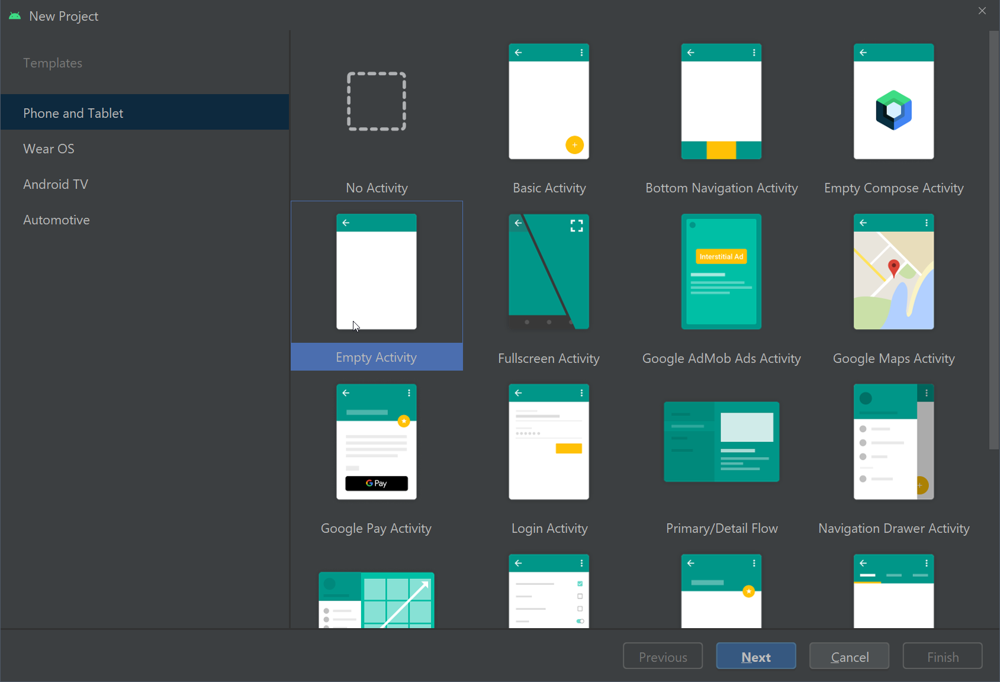

Далі ми потрапляємо у вікно налаштувань проєкту, нам необхідно вказати назву додатка, пакет, вибрати директорію для розташування проєкту, мову проєкту і мінімальну версію Android для запуску програми.

  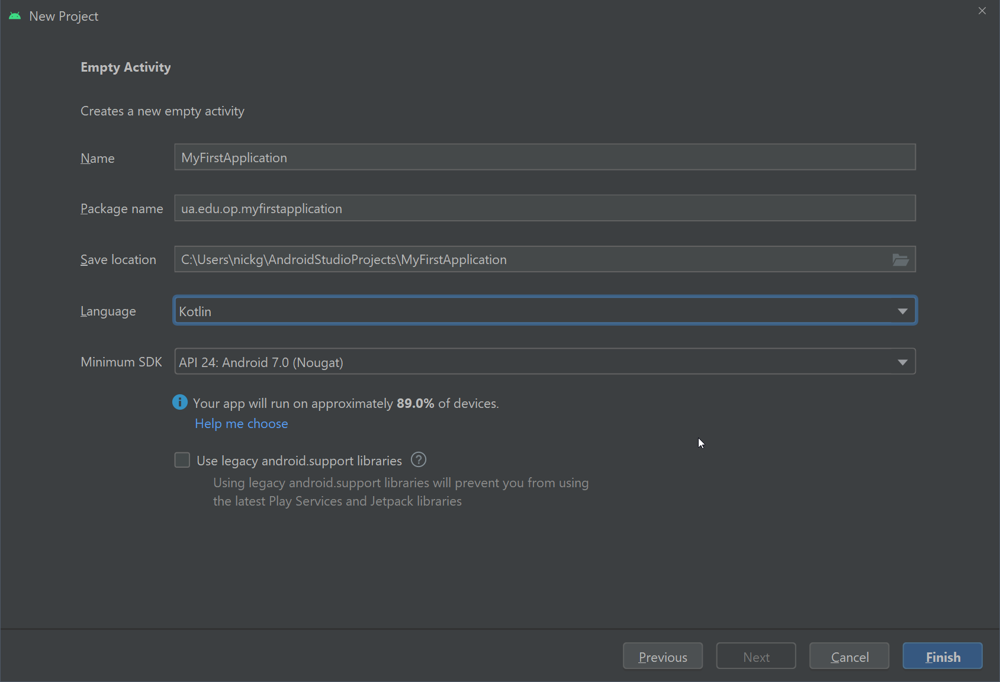

При натисканні на посилання **Help me choose** з'являється вікно з вибором версії, де ви зможете прочитати інформацію про фічі, додані в цій версії, а також дізнатися - скільки відсотків цільових пристроїв на Android підтримують ту чи іншу версію Android.

*Вибір мінімальної версії є відкритим питанням. Часто це залежить від необхідності наявності критичних для додатка функцій, які можуть бути відсутніми в старих версіях Android. Іноді можна знайти пораду, що ваш застосунок має підтримувати щонайменше 90% пристроїв. Рекомендується встановити версію 21 або новішу, оскільки більшість бібліотек перестали підтримувати API 19 і нижче, Google перестав надсилати оновлення для пристроїв API 18 і нижче.*

  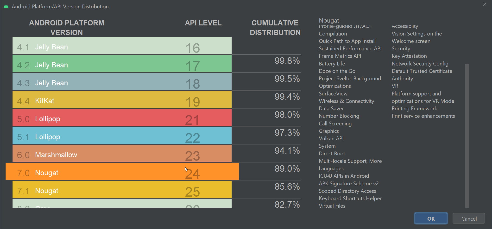

Зверніть увагу на поняття **API Level**. Якщо звичайний користувач android-пристроїв оперує "версіями Android", то розробник оперує версіями API, які визначають кодову базу та інші важливі для розробника речі. У програмі та при розробці додатків, завжди оперуйте версіями API.

*Детальну інформацію про співвідношення версій API і "версій Android" можна знайти [тут](https://apilevels.com) або [тут](https://developer.android.com/guide/topics/manifest/uses-sdk-element).*

Після закінчення роботи майстра, Android Studio завантажить потрібні файли і плагіни, після чого буде отримано стартовий проект android-додатка.

Давайте спробуємо це запустити, а для цього скористаємося емулятором Android.

### Створення та запуск емулятора для Android

Для запуску додатків можна використовувати фізичні Android-пристрої, але це не дуже зручно, особливо в процесі додавання нового функціоналу і налагодження.

Для комфортного написання Android-додатків передбачено емулятор різних Android-пристроїв, який дає змогу заздалегідь протестувати роботу програми на різних пристроях найрізноманітнішої конфігурації.

Для роботи з емуляторами скористаємося вбудованою програмою Device Manager, яку можна відкрити через меню (**Tools -> Device Manager**) або через кнопку на панелі праворуч.

  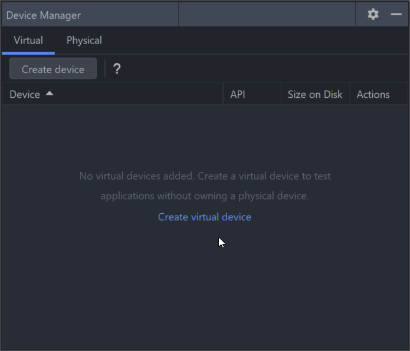

Device Manager керує не тільки віртуальними, а й фізичними пристроями теж. Створимо новий віртуальний пристрій. Для цього натиснемо Create virtual device, після чого ми потрапляємо у вікно створення нового пристрою.

  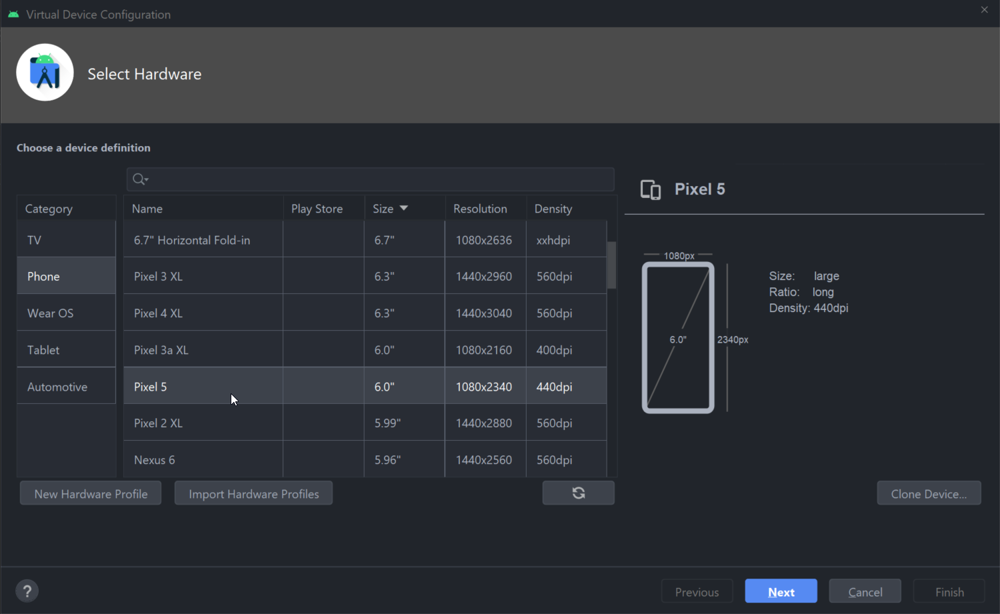

У цьому вікні можна вибрати тип цільового пристрою, а також один із можливих апаратних профілів (поєднання фізичних розмірів, роздільної здатності екрана, сенсорів та інших параметрів). За бажання ви можете створити свій апаратний профіль або імпортувати наявний.

  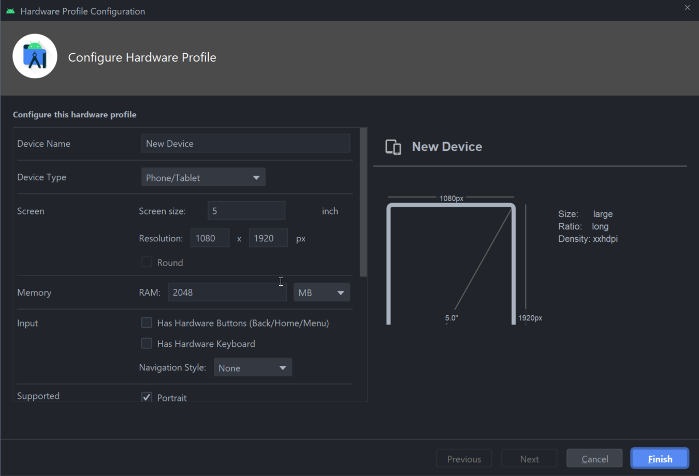

У вікні створення апаратного профілю ви можете вибрати будь-які поєднання апаратних параметрів пристрою - наявність камер, фізичної клавіатури, сенсорів, а також фізичні розміри і роздільну здатність екрану.

Після вибору апаратного профілю, необхідно вибрати версію операційної системи і образу, який буде використовуватися в емуляторі.

  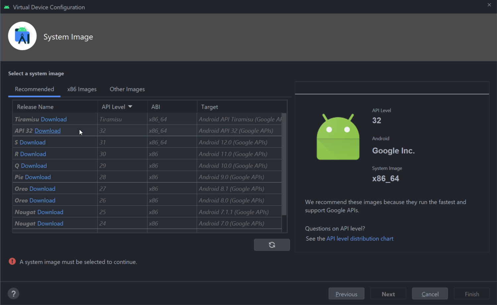

Краще вибирати найсвіжішу стабільну версію операційної системи.

### Запуск програми на фізичному пристрої

Щоб мати можливість налагодження додатка на вашому телефоні або планшеті, необхідно виконати такі дії:

- увімкнути режим розробника і дозволити налагодження по USB;
- завантажити драйвери для налагодження по USB;
- встановити драйвери для налагодження по USB.

Для налагодження, ваш пристрій має бути під'єднаний до комп'ютера за допомогою USB-кабелю. Під час спроби запустити ваш додаток, необхідно підтвердити дію на пристрої.

Якщо ви зробили все коректно, то під час запуску застосунку у вас в опціях з'явиться ваш під'єднаний пристрій як цільовий.

## Структура android-проекту

Повернемося в головне вікно Android Studio і розглянемо складові частини проєкту, з яких файлів складається проєкт і для чого вони потрібні.

### Дерево проекту

Для початку розглянемо панель Project у лівій частині середовища розробки.

  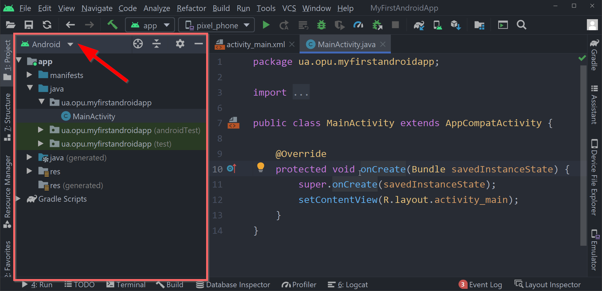

Дерево проєкту допомагає керувати файлами проєкту, а випадаюче меню у верхній частині дає змогу акцентувати увагу на тих чи інших аспектах проєкту.

  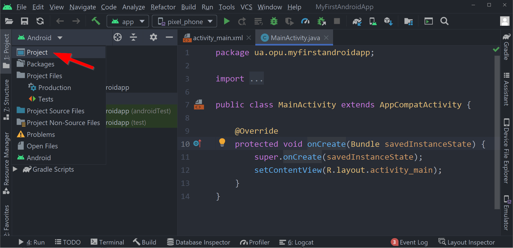

### Структура проекту

Для детального вивчення структури android-проєкту, виберемо вид Project.

Рассмотрим структуру проекта на верхнем уровне:

  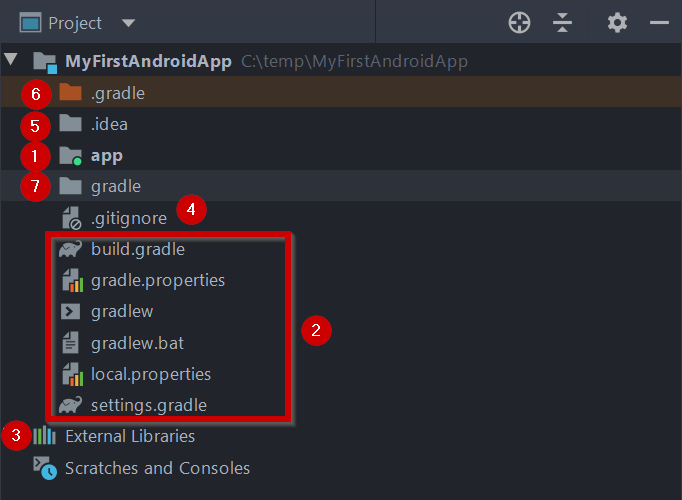

1. Директорія **app** містить файли, які відносяться до окремого модуля проекту. Модуль - складова автономна частина проєкту, у будь-якому проєкті має бути, як мінімум, один модуль. При створенні проекту, за замовчуванням, створюється модуль з ім'ям **app**. Вміст цієї директорії ми розглянемо трохи пізніше;
2. Набір файлів, які відносяться до збірки нашого проекту за допомогою збирача Gradle. З деякими файлами ми будемо взаємодіяти під час проєкту. Серед усіх зазначених файлів, нас може цікавити файл **build.gradle**, який містить інструкції для складання проєкту загалом;
3. Пункт External Libraries містить список зовнішніх бібліотек, включно з бібліотеками Java, SDK, а також бібліотеками Gradle;
4. Файл **.gitignore** відноситься до системи контролю версій Git;
5. Директорія **.idea** містить файли, специфічні для середовища розроблення Android Studio;
6. Директорія **.gradle** містить виконувані файли для збирача Gradle;
7. Директорія **gradle** містить скрипт **Gradle Wrapper** для скачування та встановлення потрібної версії Gradle.

### Структура директорії модуля

Директорія модуля є для нас основною, з якою ми працюватимемо найчастіше.

  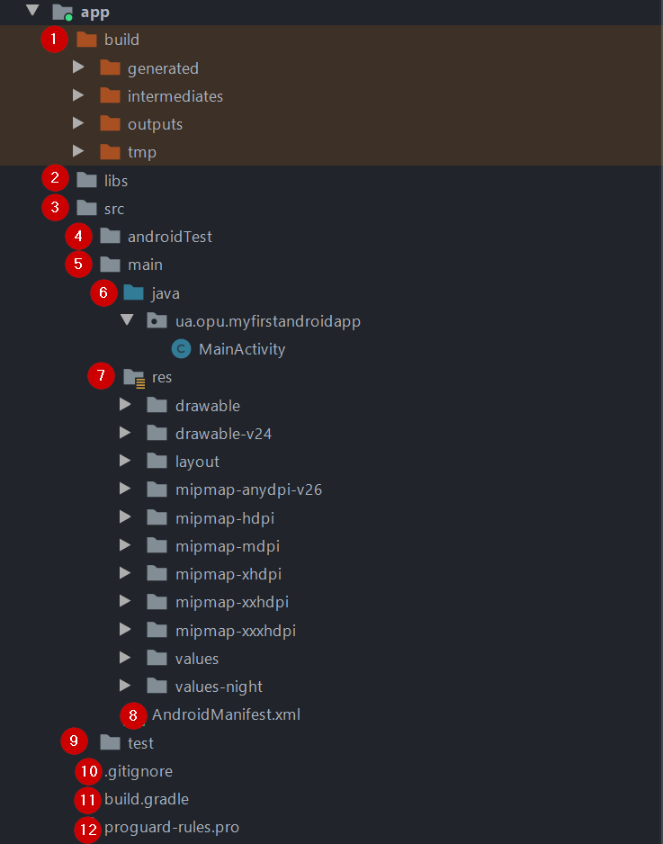

Давайте розберемося, що знаходиться всередині цієї директорії:

1. Директорія `build` містить файли, пов'язані з процесом складання і тестування проекту. Як правило, файли в директорії `build` генеруються автоматично і редагувати їх не варто;
2. Якщо ви хочете додати сторонні бібліотеки вручну, ви можете помістити їх у папку `libs`, щоб вони були доступні всередині модуля;
3. Директорія `src` містить набір файлів вихідного коду та файли, що відносяться до "вихідних кодів" проєкту (це не тільки вихідний код класів у вигляді файлів `.java`);
4. Усередині директорії `src` знаходиться папка `androidTest`, що містить вихідні файли для тестування додатка на емуляторі або фізичному пристрої;
5. Директорія `main` усередині src містить "основний" набір вихідних кодів проєкту;
6. Директорія `java` містить вихідний код java-класів модуля;
7. Директорія `res` містить набір так званих **ресурсів** (**resources**), які не є вихідним кодом, але включаються у ваш проєкт. До ресурсів, наприклад, належать зображення, текстові написи, аудіо- та відеофайли тощо. Тема ресурсів є однією з ключових, тому ми детально розбиратимемо її пізніше;
8. Окремо слід згадати **файл маніфесту**, який містить інформацію про компоненти додатка та потрібен для коректної роботи ОС з вашим додатком;
9. Директорія `test` містить код для тестування коду на вашому комп'ютері, в рамках роботи JVM;
10. Файл `.gitignore` відноситься до системи контролю версій Git;
11. Файл `build.gradle` містить інструкції для збірки цього модуля;
12. Файл `proguard-rules.pro` використовується для технології [ProGuard](https://www.guardsquare.com/en/products/proguard), що дає змогу оптимізувати байт-код додатка, зменшити обсяг додатка, збільшити швидкість роботи додатка, а також підвищити рівень безпеки за допомогою обфускації коду.